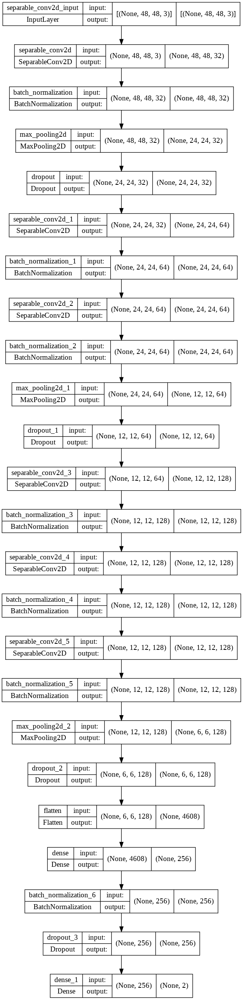

# Histopathological Breast Cancer Detection using Deep Learning

## Introduction

This project involves the detection of breast cancer in histopathological images using deep learning. The code uses TensorFlow and Keras to train a Convolutional Neural Network (CNN) on a dataset of Breast Cancer Images. The trained model is then used to predict whether a given image contains cancerous cells or not.

## Installation

1. Clone the repository
2. Install the required packages using pip install -r requirements.txt
3. Run the Jupyter Notebook using jupyter notebook

## Dataset

The dataset used in this project is the [Breast Cancer Histopathological Database](https://www.kaggle.com/paultimothymooney/breast-histopathology-images) from Kaggle.

## Model

The model used in this project is a convolutional neural network (CNN) with the following architecture:

## Steps

1. Import Libraries: Essential libraries and modules, such as TensorFlow, Keras, NumPy, and Matplotlib, are imported. The project also takes advantage of the ImageDataGenerator class from Keras for data augmentation and the LearningRateScheduler class for dynamic adjustment of the learning rate throughout training.

2. Data Acquisition and Preparation: The dataset used in this project is the [Breast Cancer Histopathology Images dataset](https://www.kaggle.com/paultimothymooney/breast-histopathology-images), which contains over 277,000 images of breast tissue. The dataset is first downloaded from Kaggle, unzipped, and then split into training, validation, and testing sets. Specifically, 72% of the data is allocated for training, 8% for validation, and 20% for testing.

3. Data Exploration: The data is explored and visualized using matplotlib. To understand the distribution of positive and negative cases in the dataset a pie chart is plotted.

4. Model Training: A Convolutional Neural Network (CNN) is trained on this dataset, making use of both training and validation sets. The model is compiled using the Adagrad optimizer, the binary cross-entropy loss function, and its learning rate is adjusted as needed using a LearningRateScheduler.

5. Model Evaluation: The model's performance is evaluated using the testing set. The results are displayed in the form of a confusion matrix and various metrics such as accuracy, sensitivity, and specificity are calculated.

6. Model Usage: The trained model can be used to predict whether a given histopathological image contains cancerous cells or not. The prediction is displayed along with the input image.

## Results

The trained model showcased an impressive accuracy of 83.01% on the validation set and 82.6% on the test set. Further metrics revealed a sensitivity of 0.8301 and a specificity of 0.8156.
